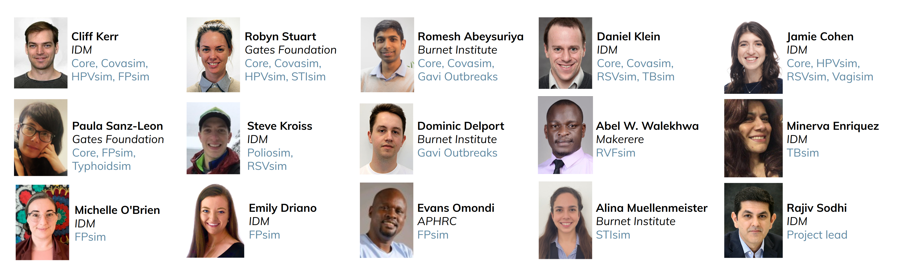

# Contact

Have questions? Want to collaborate? We'd love to hear from you!

<ul id="icons-links" class="text-center" style="margin-top:10px;">
<a href="mailto: info@starsim.org"><button class="btn btn-primary" style="font-weight:normal;"> info@starsim.org

</button></a>
</ul>

---

© 2024-2025 Bill & Melinda Gates Foundation

Starsim is being developed by the [Institute for Disease Modeling](https://idmod.org), the [Burnet Institute](https://burnet.edu.au), and other collaborators.

[Privacy & cookies](https://www.gatesfoundation.org/Privacy-and-Cookies-Notice) | [Terms of use](https://www.gatesfoundation.org/Terms-of-Use)

Starsim is distributed under the MIT License to provide others with a better understanding of our research and an opportunity to build upon it for their own work. We make no representations that the code works as intended or that we will provide support, address issues that are found, or accept pull requests. You are welcome to [create your own fork](https://github.com/starsimhub/starsim/fork) and modify the code to suit your own modeling needs as permitted under the MIT License. 