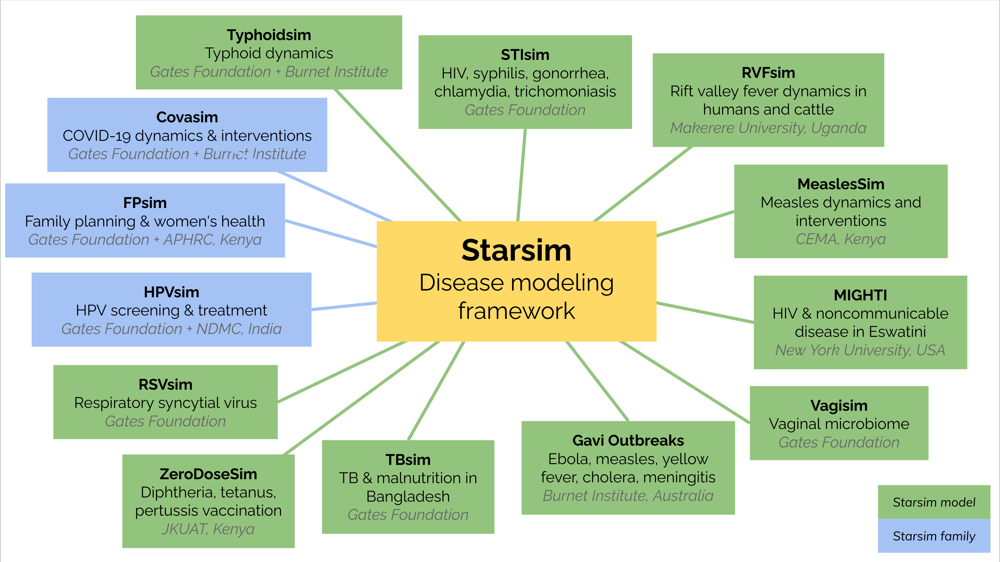

# Models

The Starsim ecosystem currently consists of the following models:

Since the Starsim framework was only released in mid 2024, most of these models are still under development and are not yet available for public use. However, STIsim is [available on GitHub](https://stisim.org), and Gavi Outbreaks [has been published](https://www.medrxiv.org/content/10.1101/2024.06.02.24308241v1.full). Other models based on Starsim principles ([Covasim](https://stisim.org), [HPVsim](https://hpvsim.org), and [FPsim](https://fpsim.org)) are also available. 