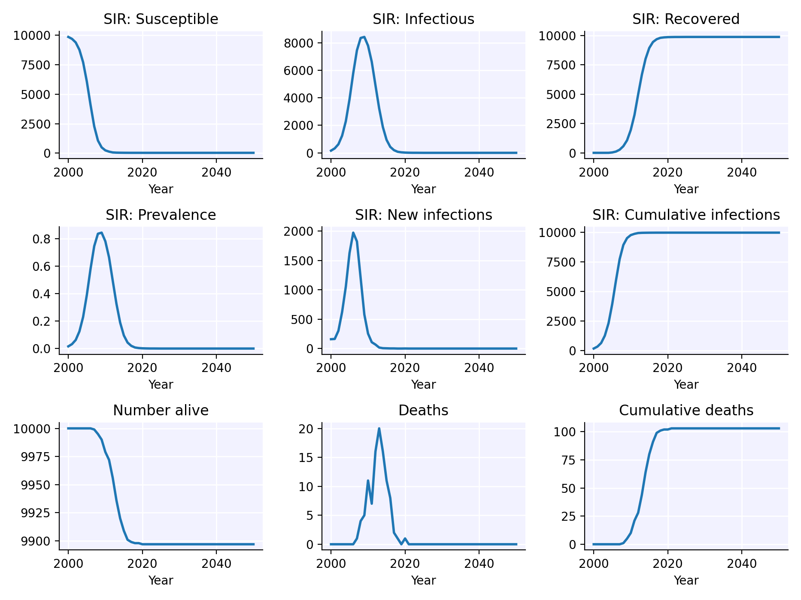
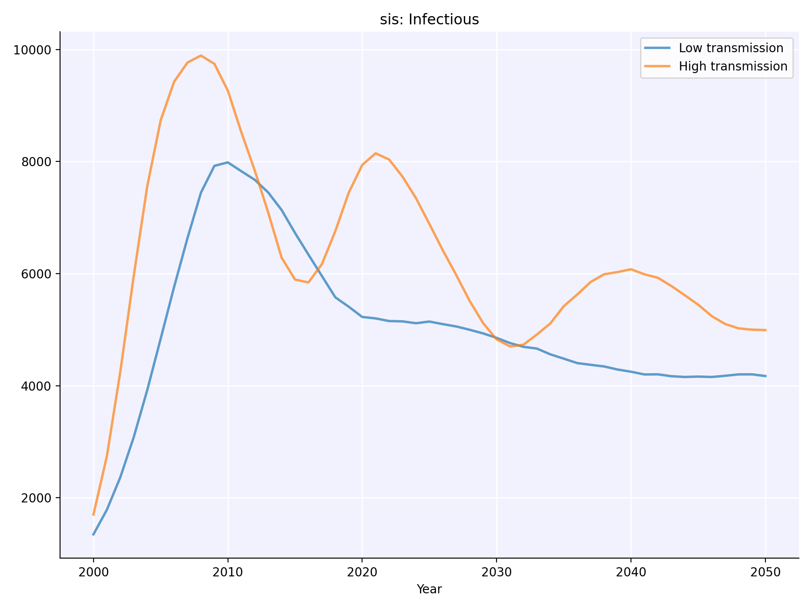
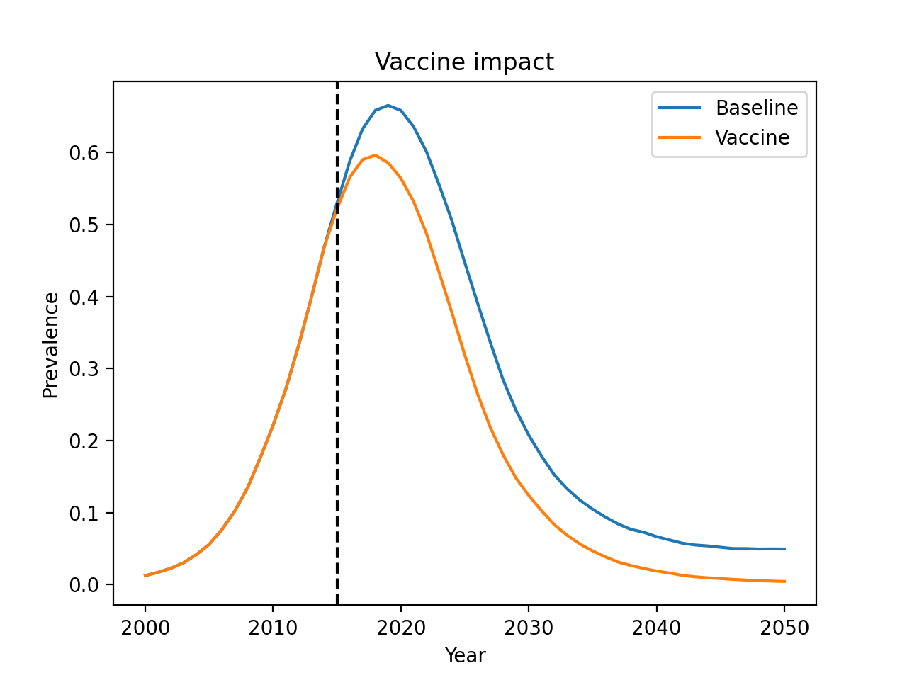
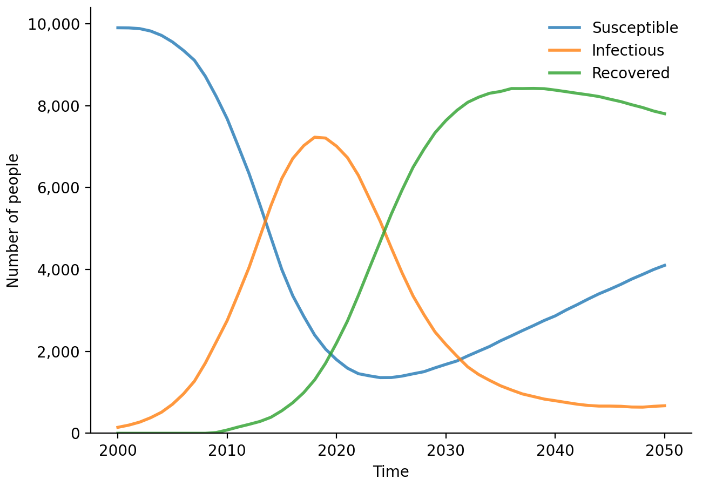
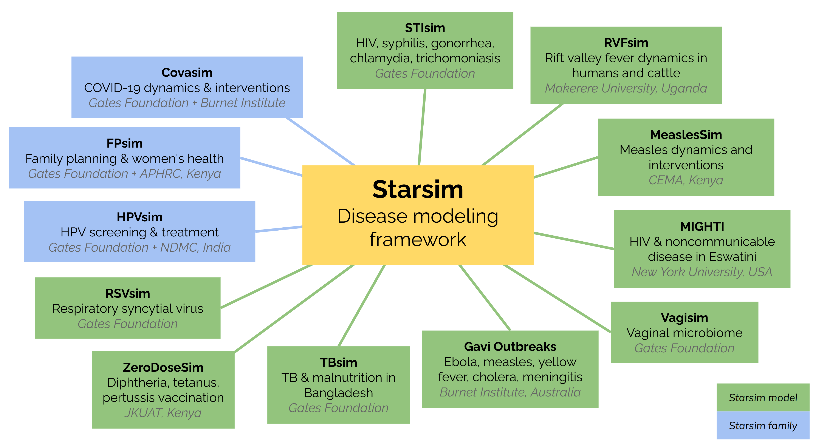
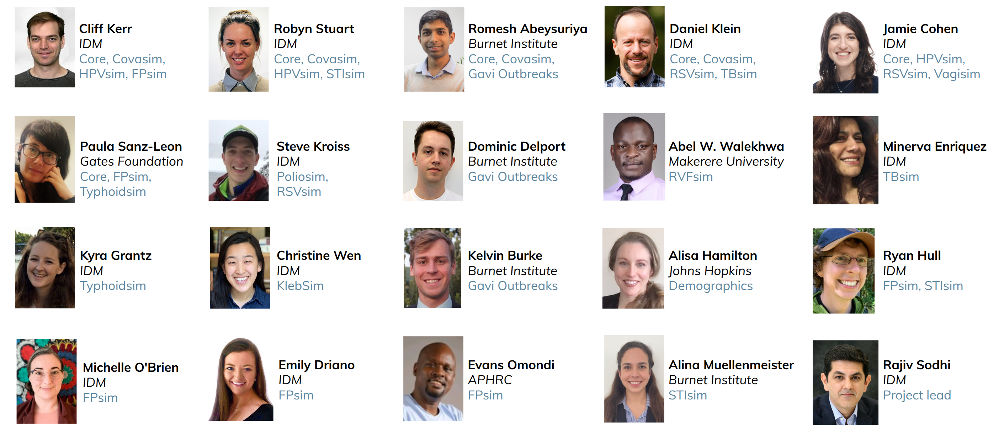

```{=html}
<iframe src="https://www.googletagmanager.com/ns.html?id=GTM-NK4K647" height="0" width="0" style="display:none;visibility:hidden"></iframe>
<nav class="navbar navbar-expand-lg fixed-top" color-on-scroll="450">
  <div class="container">
    <div class="navbar-translate">
      <a class="navbar-brand" href="https://starsim.org/"><h1 style="font-size:32px;margin:0;padding:0; font-weight:300;"></h1></a>
      <button class="navbar-toggler navbar-toggler-right navbar-burger" type="button" data-toggle="collapse" data-target="#navbarToggler" aria-expanded="false" aria-label="Toggle navigation">
        <span class="navbar-toggler-bar"></span>
        <span class="navbar-toggler-bar"></span>
        <span class="navbar-toggler-bar"></span>
      </button>
    </div>
    <div class="collapse navbar-collapse" id="navbarToggler">
      <ul class="navbar-nav ml-auto">
        <li class="nav-item"><a href="#what" class="header_link"> What?</a></li>
        <li class="nav-item"><a href="#why" class="header_link"> Why?</a></li>
        <li class="nav-item"><a href="#installation" class="header_link"> Install</a></li>
        <li class="nav-item"><a href="#examples" class="header_link"> Examples</a></li>
        <li class="nav-item"><a href="#models" class="header_link"> Models</a></li>
        <li class="nav-item"><a href="#events" class="header_link"> Events</a></li>
        <li class="nav-item"><a href="#publications" class="header_link"> Papers</a></li>
        <li class="nav-item"><a href="#contact" class="header_link"> Contact</a></li>
      </ul>
    </div>
  </div>
</nav>
```

::: {.wrapper}

```{=html}
<div class="page-header page-header-small" style="background-image: url('./assets/img/background-network-v2.jpg');">
  <div class="container">
    <div class="filter"></div>
    <div class="motto">
      <h1 style="padding-top:40px; font-weight:bold; font-size:3em;">A fast, flexible agent-based disease modeling framework</h1>
    </div>
  </div>
</div>
```

::: {.main}
::: {.section style="padding:0px;"}
::: {.container}

<!-- ── What is Starsim? ─────────────────────────────────────── -->

::: {#what .row}
::: {.col-md-12 .ml-auto .mr-auto}

## What is Starsim? {.text-center style="padding-top:80px; margin-top:-20px; padding-bottom:20px; font-weight:bold; color:#333333;"}

::: {.row}
::: {.col-md-9 .ml-auto .mr-auto}

Starsim is a framework for modeling the spread of diseases among agents via dynamic transmission networks. Starsim supports:

- **Co-transmission** of multiple diseases at once, capturing how they interact biologically and behaviorally
- **Non-infectious diseases**, either on their own or as factors affecting the transmission or mortality of infectious diseases
- Detailed modeling of **mother-child relationships** starting from conception, allowing investigation of infant and childhood diseases
- Multiple types of **transmission network**, including theoretical (e.g. Erdős–Rényi) and realistic (e.g. age-assortative sexual partnerships)
- Different **intervention types**, such as vaccines or treatments, and showing their impact through different delivery methods such as mass campaigns or targeted outreach
- Automated **calibration** to data, plus careful handling of random numbers to minimize variance between simulations
- Flexible **levels of detail**, including agent-based, metapopulation, and compartmental modeling
- **AI-accelerated development** via our dedicated [Starsim-AI](https://github.com/starsimhub/starsim_ai) tools (including MCP servers, skills, and plugins) that you can use with your favorite code editor

Starsim is available for both Python and R, and is fully open-source under the MIT license.

:::
:::
:::
:::

<!-- external links -->
```{=html}
<div class="col-md-12 ml-auto mr-auto">
  <ul id="icons-links" class="text-center" style="margin-top:0px">
    <a href="https://docs.starsim.org" target="_blank"><button class="btn btn-primary">&nbsp;&nbsp;Docs<div class="ripple-container"></div></button></a>
    <a href="https://docs.idmod.org/projects/starsim/en/latest/tutorials.html" target="_blank"><button class="btn btn-primary">&nbsp;Tutorials<div class="ripple-container"></div></button></a>
    <a href="https://github.com/starsimhub/starsim" target="_blank"><button class="btn btn-primary">&nbsp;&nbsp;Code<div class="ripple-container"></div></button></a>
    <a href="https://r.starsim.org" target="_blank"><button class="btn btn-primary">&nbsp;&nbsp;R Docs<div class="ripple-container"></div></button></a>
    <a href="https://github.com/starsimhub/starsim_ai" target="_blank"><button class="btn btn-primary">&nbsp;&nbsp;AI<div class="ripple-container"></div></button></a>
  </ul>
</div>
```

<!-- ── Why Starsim? ─────────────────────────────────────────── -->

::: {#why .row}
::: {.col-md-12 .ml-auto .mr-auto}

## Why Starsim? {.text-center style="padding-top:80px; margin-top:-20px; padding-bottom:20px; font-weight:bold; color:#333333;"}

::: {.row}

::: {.col-md-4}
::: {.card .card-blog .card-top-shadow}
::: {.card-body style="min-height: 300px;"}

#### High performance {.card-category .text-center style="font-weight:bold; font-size: 18px;"}

::: {.card-image .text-center}
{style="width:17%; margin:5px 0; padding: 5px 0;"}
:::

Array computations and just-in-time [compilation](https://numba.pydata.org/) mean Starsim achieves C++ speeds from pure Python. Starsim runs on laptops, not supercomputers, via either R or Python.

:::
:::
:::

::: {.col-md-4}
::: {.card .card-blog .card-top-shadow}
::: {.card-body style="min-height: 300px;"}

#### Easy to use {.card-category .text-center style="font-weight:bold; font-size: 18px;"}

::: {.card-image .text-center}
{style="width:17%; margin:5px 0; padding: 5px 0;"}
:::

Starsim's modular structure means you can reuse or adapt existing disease models, transmission networks, and demographics. Mix, match, and modify any module you want.

:::
:::
:::

::: {.col-md-4}
::: {.card .card-blog .card-top-shadow}
::: {.card-body style="min-height: 300px;"}

#### Global community {.card-category .text-center style="font-weight:bold; font-size: 18px;"}

::: {.card-image .text-center}
{style="width:17%; margin:5px 0; padding: 5px 0;"}
:::

Starsim is a community, not a product. We believe that diversity, transparency, and collaboration are essential for achieving real-world health outcomes.

:::
:::
:::

:::
:::
:::

<!-- ── Installation ─────────────────────────────────────────── -->

::: {#installation .row}
::: {.col-md-12 .ml-auto .mr-auto}

## Installation {.text-center style="padding-top:80px; margin-top:-20px; padding-bottom:20px; font-weight:bold; color:#333333;"}

::: {.row}
::: {.col-md-9 .ml-auto .mr-auto}

If you have Python, you can install Starsim:

```bash
> pip install starsim
```

Or from R:

```r
devtools::install_github("starsimhub/rstarsim")
library(starsim)
init_starsim()
```

:::
:::
:::
:::

<!-- ── Examples ──────────────────────────────────────────────── -->

::: {#examples .row}
::: {.col-md-12 .ml-auto .mr-auto}

## Examples {.text-center style="padding-top:80px; margin-top:-20px; padding-bottom:20px; font-weight:bold; color:#333333;"}

::: {.col-md-9 .ml-auto .mr-auto}
::: {.panel-tabset}

### Simple example

This is what an extremely simple Starsim simulation looks like:

1. Create a susceptible-infectious-recovered (SIR) disease model with default parameters.
2. Create a random transmission network between agents (also with default parameters).
3. Run the simulation and plot the results.

```python
import starsim as ss

sim = ss.Sim(diseases='sir', networks='random') # Create the sim
sim.run() # Run the sim
sim.plot() # Plot the results
```

{width="100%" .card-top-shadow}

### Running scenarios

You can easily customize model parameters, and run simulations in parallel:

1. Create a dictionary defining the parameters of the simulation.
2. Modify only those parameters you want to differ between scenarios.
3. Run the simulations in parallel, and plot the results you are interested in.

```python
import starsim as ss
import sciris as sc

# Set the parameters for the baseline simulation
pars1 = sc.objdict( # Note: can also use regular Python dictionary
    n_agents = 10_000,     # Number of agents to simulate
    networks = sc.objdict( # *Networks* add detail on how the agents interact with each other
        type = 'random',   # Here, we use a 'random' network
        n_contacts = 4     # Each person has an average of 4 contacts with other people
    ),
    diseases = sc.objdict( # *Diseases* add detail on what diseases to model
        type = 'sis',      # Here, we're creating an SIS disease
        init_prev = 0.1,   # Proportion of the population initially infected
        beta = 0.1,        # Probability of transmission between contacts
    )
)

# Make a modified version of the parameters for the scenario
pars2 = pars1.copy(deep=True)
pars2.diseases.beta = 0.2

# Create the simulations
s1 = ss.Sim(pars1, label='Low transmission')
s2 = ss.Sim(pars2, label='High transmission')

# Run and plot the simulations
msim = ss.parallel(s1, s2)
msim.plot('sis_n_infected')
```

{width="100%" .card-top-shadow}

### Custom interventions

Everything in Starsim can be customized, including diseases, demographics, and interventions. This example shows how to write custom interventions, namely a vaccine product and vaccination campaign:

```python
import starsim as ss
import matplotlib.pyplot as plt

# Define the simulation parameters
pars = dict(
    n_agents = 20_000,
    birth_rate = 20,
    death_rate = 15,
    networks = dict(
        type = 'random',
        n_contacts = 4
    ),
    diseases = dict(
        type = 'sir',
        dur_inf = 10,
        beta = 0.1,
    )
)

# Create the product: a vaccine with 50% efficacy
my_vaccine = ss.sir_vaccine(efficacy=0.5)

# Create the vaccine campaign
campaign = ss.routine_vx(
    start_year = 2015,    # Begin vaccination in 2015
    prob = 0.2,           # 20% coverage
    product = my_vaccine  # Use the MyVaccine product
)

# Now create two sims: a baseline sim and one with the intervention
sim_base = ss.Sim(pars=pars)
sim_intv = ss.Sim(pars=pars, interventions=campaign)

# Run sims in parallel
sims = ss.parallel(sim_base, sim_intv).sims
base = sims[0].results
vax = sims[1].results

# Plot
plt.figure()
plt.plot(base.yearvec, base.sir.prevalence, label='Baseline')
plt.plot(vax.yearvec, vax.sir.prevalence, label='Vaccine')
plt.axvline(x=2015, color='k', ls='--')
plt.title('Vaccine impact')
plt.xlabel('Year')
plt.ylabel('Prevalence')
plt.legend()
```

{width="100%" .card-top-shadow}

### R example

Starsim can be run from R just as easily as from Python:

```r
# Load Starsim
library(starsim)
load_starsim()

# Set the simulation parameters
pars <- list(
    n_agents = 10000,
    birth_rate = 20,
    death_rate = 15,
    networks = list(
        type = 'randomnet',
        n_contacts = 4
    ),
    diseases = list(
        type = 'sir',
        dur_inf = 10,
        beta = 0.1
    )
)

# Create, run, and plot the simulation
sim <- ss$Sim(pars)
sim$run()
sim$diseases$sir$plot()
```

{width="100%" .card-top-shadow}

:::
:::
:::
:::

<!-- ── Models ────────────────────────────────────────────────── -->

::: {#models .row}
::: {.col-md-12 .ml-auto .mr-auto}

## Models {.text-center style="padding-top:80px; margin-top:-20px; padding-bottom:20px; font-weight:bold; color:#333333;"}

::: {.row}
::: {.col-md-9 .ml-auto .mr-auto}

The Starsim ecosystem contains many different disease-specific models, for example:

{width="100%" .card-top-shadow}

Key models include [STIsim](https://stisim.org) (which includes HIVsim), [HPVsim](https://hpvsim.org), [FPsim](https://fpsim.org), [TBsim](https://starsim.org/tbsim), [Covasim](https://stisim.org), and [Gavi Outbreaks](https://www.medrxiv.org/content/10.1101/2024.06.02.24308241v1.full). A more detailed list of Starsim models is available [here](https://docs.starsim.org/user_guide/intro_models.html).

:::
:::
:::
:::

<!-- ── Events ────────────────────────────────────────────────── -->

::: {#events .row}
::: {.col-md-12 .ml-auto .mr-auto}

## Events {.text-center style="padding-top:80px; margin-top:-20px; padding-bottom:20px; font-weight:bold; color:#333333;"}

::: {.row}
::: {.col-md-9 .ml-auto .mr-auto}

###### Upcoming events

::: {.events-table}
::: {.row}
::: {.lcell}
**Talk \@ SciPy 2026**\
Jul. 13-19, 2026: Minneapolis, USA
:::
::: {.rcell}
A talk on Starsim-AI performance will be given at the [SciPy 2026](https://www.scipy2026.scipy.org/) (Scientific Python) conference.
:::
:::
:::

###### Past events

::: {.events-table}
::: {.row}
::: {.lcell}
**Talk \@ EPIDEMICS 10**\
Nov. 30-Dec. 3, 2025: San Diego, USA
:::
::: {.rcell}
A talk on Starsim was given at the [EPIDEMICS 10](https://www.elsevier.com/events/conferences/all/international-conference-on-infectious-disease-dynamics) conference (10th International Conference on Infectious Disease Dynamics). Several other talks and posters using Starsim were also presented. Slides are available [here](https://docs.google.com/presentation/d/1-gwTMl1OElZNIYcLfpCemfkuo5VhU_hOWvt6YfH49Q8/edit?usp=sharing).
:::
:::
::: {.row}
::: {.lcell}
**Talk \@ MIDAS 2024**\
Nov. 18, 2024: Silver Spring, USA
:::
::: {.rcell}
An introductory talk on Starsim was given at the 2024 [MIDAS Conference](https://midasnetwork.us/midas-2024/). Slides are available [here](https://docs.google.com/presentation/d/160gNQ89wNaZf9XTjhj5-H3TMB--vX5FnnnqQz2QgdL8/edit).
:::
:::
::: {.row}
::: {.lcell}
**Talk \@ IDM Conference 2024**\
Nov. 8, 2024: Bangkok, Thailand
:::
::: {.rcell}
A talk introducing Starsim was given at the 2024 [Infectious Disease Modelling Conference](https://idmconference.net). Slides are available [here](https://docs.google.com/presentation/d/1bVG_HJxoT07UG6YqR5vaH8jDtt2VsgsSOHkuEpVvww0/edit).
:::
:::
::: {.row}
::: {.lcell}
**Starsim Learning Day \@ IDM Symposium**\
Oct. 3, 2024: Seattle, USA
:::
::: {.rcell}
We conducted a full-day information and training session on Starsim as part of the 2024 IDM Symposium. Course content is available [here](https://learningday2024.starsim.org).
:::
:::
::: {.row}
::: {.lcell}
**Poster \@ AIDS 2024**\
Jul. 25, 2024: Munich, Germany
:::
::: {.rcell}
A poster on using Starsim to model HIV-STI coinfection was presented at the [AIDS 2024](https://www.iasociety.org/conferences/aids2024) conference. The poster is available [here](https://docs.google.com/presentation/d/1ObX11ExrtueXWAsPqPhV01SRoRLXDr5dB2AtKKhcZuk/edit).
:::
:::
::: {.row}
::: {.lcell}
**Starsim Launch \@ Scipy 2024**\
Jul. 10, 2024: Tacoma, USA
:::
::: {.rcell}
Starsim v1.0 was officially launched at the [SciPy 2024](https://www.scipy2024.scipy.org/) conference. The slides from the talk are available [here](https://docs.google.com/presentation/d/13kWAiYRiPvlWXDitE5UVNlsrxOMPjG1sSPd2gsMqoQU/edit).
:::
:::
::: {.row}
::: {.lcell}
**Agent-Based Modelling Training**\
Apr. 8-19, 2024: Nairobi, Kenya
:::
::: {.rcell}
In collaboration with the [African Population & Health Research Center](https://aphrc.org/) (APHRC) and the [Center for Epidemiological Modelling and Analysis](https://cema.africa/) (CEMA), we conducted a workshop on agent-based modeling, including Starsim. The brochure is available [here](https://drive.google.com/file/d/1Ya1S7RvRI3U_EQscRWpmpF7cILTELgAC/view); other materials are available upon request.
:::
:::
:::

:::
:::
:::
:::

<!-- ── Publications ─────────────────────────────────────────── -->

::: {#publications .row}
::: {.col-md-12 .ml-auto .mr-auto}

## Publications {.text-center style="padding-top:80px; margin-top:-20px; padding-bottom:20px; font-weight:bold; color:#333333;"}

Starsim has not yet been published. But if you want to cite it, please use:

::: {.citation}
Kerr CC, Stuart RM, Abeysuriya R, Cohen JA, Sanz-Leon P, Klein DJ (2026). *Starsim: A fast, flexible framework for agent-based modeling of health and disease.* In preparation.
:::

However, several other papers have been published that have used Starsim:

::: {.citation}
Stuart R, Theopold N, Miall N, Kobayashi E, Vernam S, Taskin T, Dull PM (2026). *[The role of HPV single-dose vaccination in expanding access in GAVI-supported countries during a period of supply constraints.](https://www.sciencedirect.com/science/article/abs/pii/S0264410X25014859)* Vaccine, 75: 128187.
:::

::: {.citation}
Stuart RM, Newman LM, Manguro G, Dziva Chikwari C, Marks M, Peters RPH, Klein D, Snyder L, Kerr C, Rao DW (2026). *[Reduction in overtreatment of gonorrhoea and chlamydia through point-of-care testing compared with syndromic management for vaginal discharge: A modelling study for Zimbabwe.](https://sti.bmj.com/content/early/2026/02/05/sextrans-2025-056646)* Sexually Transmitted Infections.
:::

::: {.citation}
Sturman F, Swallow B, Kerr C, Stuart RM, Panovska-Griffiths J (2025). *[Can pruning improve agent-based models' calibration? An application to HPVsim.](https://www.sciencedirect.com/science/article/pii/S0022519325000967)* Journal of Theoretical Biology, 611: 112130.
:::

::: {.citation}
Stuart RM, Cohen JA, Kerr CC, Mathur P, National Disease Modelling Consortium of India, Abeysuriya RG, Zimmermann M, Rao DW, Boudreau MC, Lee S, Yang L, Klein DJ (2024). *[HPVsim: An agent-based model of HPV transmission and cervical disease.](https://journals.plos.org/ploscompbiol/article?id=10.1371/journal.pcbi.1012181)* PLOS Computational Biology, 20(7): e1012181.
:::

::: {.citation}
Klein DJ, Abeysuriya RG, Stuart RM, Kerr CC (2024). *[Noise-free comparison of stochastic agent-based simulations using common random numbers.](https://arxiv.org/abs/2409.02086)* arXiv:2409.02086.
:::

::: {.citation}
Kerr CC, Stuart RM, Mistry D, Abeysuriya RG, Cohen JA, George L, Jastrzebski M, Famulare M, Wenger E, Klein DJ (2022). *[Python vs. the pandemic: A case study in high-stakes software development.](https://proceedings.scipy.org/articles/majora-212e5952-00e)* SciPy Proceedings.
:::

:::
:::

<!-- ── Contact ───────────────────────────────────────────────── -->

::: {#contact .row}
::: {.col-md-12 .ml-auto .mr-auto}

## Contact {.text-center style="padding-top:80px; margin-top:-20px; padding-bottom:20px; font-weight:bold; color:#333333;"}

Have questions? Want to collaborate? We'd love to hear from you!

```{=html}
<ul id="icons-links" class="text-center" style="margin-top:10px;">
  <a href="mailto: info@starsim.org"><button class="btn btn-primary" style="font-weight:normal;"> info@starsim.org<div class="ripple-container"></div></button></a>
</ul>
```

{width="100%"}

:::
:::

:::
:::
:::

:::

```{=html}
<footer class="footer footer-black">
  <div class="container footcontainer">
    <div class="row footrow" style="padding: 50px 0px;">
      <nav class="footer-nav">
        <div>
          © 2024-2026 Gates Foundation
          <br><br>
          Starsim is being developed by the <a href="https://idmod.org">Institute for Disease Modeling</a>, the <a href="https://burnet.edu.au">Burnet Institute</a>, and other collaborators.
          <br><br>
          <a href="https://www.gatesfoundation.org/Privacy-and-Cookies-Notice">Privacy &amp; cookies</a> | <a href="https://www.gatesfoundation.org/Terms-of-Use">Terms of use</a>
        </div>
      </nav>
      <div class="credits ml-auto">
        <span class="copyright">
          Starsim is distributed under the MIT License to provide others with a better understanding of our research and an opportunity to build upon it for their own work. We make no representations that the code works as intended or that we will provide support, address issues that are found, or accept pull requests. You are welcome to
          <a href="https://github.com/starsimhub/starsim/fork">create your own fork</a> and modify the code to suit your own modeling needs as permitted under the MIT License.
        </span>
      </div>
    </div>
  </div>
</footer>

<!-- Core JS Files -->
<script src="./assets/js/jquery-3.2.1.min.js" type="text/javascript"></script>
<script src="./assets/js/prism.js" type="text/javascript"></script>
<script src="./assets/js/jquery-ui-1.12.1.custom.min.js" type="text/javascript"></script>
<script src="./assets/js/popper.js" type="text/javascript"></script>
<script src="./assets/js/bootstrap.min.js" type="text/javascript"></script>
<script src="./assets/js/bootstrap-switch.min.js"></script>
<script src="./assets/js/paper-kit.js?v=2.1.0"></script>

<!-- Scrollspy: highlight active nav link based on visible section.
     Targets divs by ID since Quarto generates <div> not <section>. -->
<script>
  const changeNav = (entries, observer) => {
    entries.forEach((entry) => {
      if (entry.isIntersecting && entry.intersectionRatio >= 0.55) {
        const currentActive = document.querySelector('.navbar-nav .header_link.active');
        if (currentActive) currentActive.classList.remove('active');
        const id = entry.target.getAttribute('id');
        const newLink = document.querySelector(`.navbar-nav [href="#${id}"]`);
        if (newLink) newLink.classList.add('active');
      }
    });
  };
  const observer = new IntersectionObserver(changeNav, { threshold: 0.55 });
  ['what', 'why', 'installation', 'examples', 'models', 'events', 'publications', 'contact']
    .forEach(id => {
      const el = document.getElementById(id);
      if (el) observer.observe(el);
    });
</script>
```
